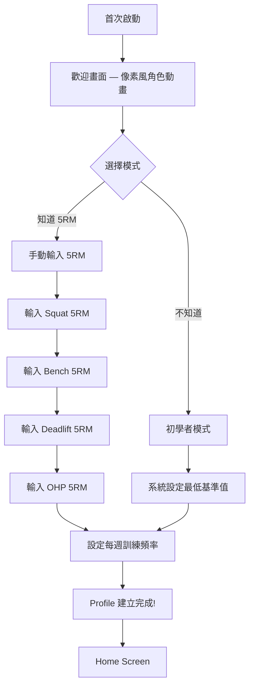

# Story UX-4: Onboarding UX Redesign

Status: done

## Story

As a new player,
I want the onboarding flow to feel like entering a game world with card-based 5RM input,
So that setting up my profile feels exciting rather than like filling a form.

## Acceptance Criteria

1. **Given** the app launches for the first time
   **When** the onboarding screen renders
   **Then** a pixel-art welcome animation plays (character sprite + "Welcome to IronMon!" in PixelText)
2. **Given** the user needs to enter 5RM values
   **When** the 5RM input step renders
   **Then** each exercise is presented as an individual `FiveRmInputCard` (one exercise per card, swipe/next to advance)
3. **And** each card displays: exercise name (中英), exercise icon/illustration, numeric input field, unit (kg)
4. **And** the numeric input uses a **number keyboard** (not full keyboard)
5. **And** input validation constrains values to 0-500kg with 0.5kg precision
6. **Given** the user doesn't know their 5RM
   **When** they select "Beginner Mode"
   **Then** the 5RM input cards are skipped and the system sets minimum defaults
7. **Given** the user completes onboarding
   **When** they tap the final confirm button
   **Then** a "Profile Created!" celebration animation plays before navigating to Home
8. **And** the entire onboarding flow uses the dark pixel theme from UX-1
9. **And** `flutter analyze` reports zero issues

## Tasks / Subtasks

- [x] Task 1: Create FiveRmInputCard widget (AC: 2, 3, 4, 5)
  - [x] 1.1 Create `lib/presentation/onboarding/widgets/five_rm_input_card.dart`
  - [x] 1.2 Card layout: exercise name (PixelText.h2), exercise subtitle (system font), input field, unit label
  - [x] 1.3 Input field: `TextFormField` with `keyboardType: TextInputType.numberWithOptions(decimal: true)`
  - [x] 1.4 Validation: `0 <= value <= 500`, step 0.5kg
  - [x] 1.5 Card background uses `IronMonColors.surfaceVariant`
  - [x] 1.6 Touch targets ≥48dp for all interactive elements

- [x] Task 2: Redesign onboarding flow with PageView (AC: 2, 6)
  - [x] 2.1 Update `lib/presentation/onboarding/onboarding_screen.dart`
  - [x] 2.2 Use `PageView` for card-by-card navigation: Welcome → Mode Select → [5RM Cards × 4] → Frequency → Confirm
  - [x] 2.3 Beginner Mode selection skips from Mode Select directly to Frequency page
  - [x] 2.4 Page indicator dots at bottom showing progress
  - [x] 2.5 "Next" button advances to next card, "Back" returns to previous
  - [x] 2.6 Auto-advance after 5RM input is confirmed (optional UX enhancement)

- [x] Task 3: Welcome animation (AC: 1)
  - [x] 3.1 Welcome page: centered pixel character sprite (placeholder colored container for MVP)
  - [x] 3.2 "Welcome to IronMon!" title in `PixelText.h1`
  - [x] 3.3 Subtitle: "Training is Battle, Progress is Upgrade" in system font
  - [x] 3.4 Fade-in animation on page appear (500ms)
  - [x] 3.5 "Begin Your Journey" button to advance

- [x] Task 4: Profile creation celebration (AC: 7)
  - [x] 4.1 On final confirm: brief celebration animation (confetti-like pixel particles or screen flash)
  - [x] 4.2 "Profile Created!" text in PixelText.h1
  - [x] 4.3 Auto-navigate to Home after 1.5s delay (or tap to skip)

- [x] Task 5: Apply dark theme (AC: 8)
  - [x] 5.1 Ensure all onboarding screens use dark background (`IronMonColors.surface`)
  - [x] 5.2 Input fields use dark theme styling (light text on dark background)
  - [x] 5.3 Page indicator dots use `IronMonColors.primary` for active, `IronMonColors.onSurfaceVariant` for inactive

- [x] Task 6: Tests (AC: 9)
  - [x] 6.1 Widget test: FiveRmInputCard renders with exercise name and input field
  - [x] 6.2 Widget test: FiveRmInputCard validates input range (0-500)
  - [x] 6.3 Widget test: beginner mode skips 5RM input cards
  - [x] 6.4 `flutter analyze` reports zero issues

## Dev Agent Record

### Implementation Plan
- Redesigned FiveRmInputCard with MuscleType integration and visual polish
- Implemented PageView-based onboarding flow with step-by-step navigation
- Added welcome page with pixel art character placeholder and fade-in animation
- Created mode selection (Beginner/Experienced) with conditional flow
- Built celebration screen with scale animation after profile creation
- Applied dark pixel theme throughout onboarding flow

### Completion Notes
- PageView provides smooth card-by-card navigation with page indicators
- Beginner mode skips 5RM input cards and sets default values
- Each 5RM card shows exercise icon, name (Chinese/English), and numeric input
- Input validation restricts values to 0-500kg with 0.5kg precision
- Celebration animation uses elastic scale effect for game-like feel

## File List

### Modified Files
- `ironmon/lib/presentation/onboarding/widgets/five_rm_input_card.dart`
- `ironmon/lib/presentation/onboarding/onboarding_screen.dart`

### New Files
- `ironmon/test/presentation/onboarding/widgets/five_rm_input_card_test.dart`
- `ironmon/test/presentation/onboarding/onboarding_screen_test.dart`

## Change Log

- 2026-02-28: Implemented onboarding UX redesign
  - Created card-based 5RM input with MuscleType integration
  - Built PageView navigation with mode selection
  - Added welcome animation and celebration screen
  - Applied dark pixel theme consistently

## Status

done

## Dev Notes

### CRITICAL — Database Is Drift 2.31.0 (NOT Isar)

Project uses Drift 2.31.0, not Isar.

### CRITICAL — No riverpod_generator

Manual providers only. No `@riverpod` annotations.

### CRITICAL — No Schema Changes

This story is presentation-only. Existing Drift schema and UserProfile logic from Stories 1.2/1.3 are reused.

### Dependencies on Previous Stories

- **Story UX-1** — Dark theme, design tokens
- **Story UX-2** — PixelText widget
- **Story 1.2** — UserProfile creation logic, UserProfileRepository
- **Story 1.3** — Beginner mode logic, calibration flag

### UX Spec Reference — Onboarding Journey



### UX Spec Reference — FiveRmInputCard

```
Purpose: Onboarding 時輸入核心動作 5RM
Content: 動作名稱（中英）、動作圖示、數字輸入欄位、單位（kg）
Validation: 0-500kg 範圍、0.5kg 精度
Architecture File: presentation/onboarding/widgets/five_rm_input_card.dart
```

### PageView Structure

```
Page 0: Welcome (character sprite + title)
Page 1: Mode Select (Experienced / Beginner)
Page 2: Squat 5RM card (skip if beginner)
Page 3: Bench Press 5RM card (skip if beginner)
Page 4: Deadlift 5RM card (skip if beginner)
Page 5: OHP 5RM card (skip if beginner)
Page 6: Weekly Frequency selector
Page 7: Confirm + celebration
```

### Architecture Compliance Rules

| Rule | Description |
|---|---|
| **Widget Pattern** | `ConsumerStatefulWidget` for OnboardingScreen (PageController + TextControllers) |
| **State Access** | `ref.read()` in callbacks to save profile |
| **Import Style** | `package:ironmon/...` only |
| **very_good_analysis** | `///` doc comments; lines ≤ 80 chars |
| **Domain boundary** | Do NOT change domain models — only presentation layer |
| **Navigation** | Use `context.go('/')` to navigate to Home after onboarding |

### Project Structure Notes

New files to create:

```
ironmon/lib/presentation/onboarding/widgets/five_rm_input_card.dart
ironmon/test/presentation/onboarding/five_rm_input_card_test.dart
```

Files to update:

```
ironmon/lib/presentation/onboarding/onboarding_screen.dart
```

### References

- [Source: ux-design-specification.md#User Journey Flows — Journey 2] — Onboarding flow diagram
- [Source: ux-design-specification.md#Component Strategy — FiveRmInputCard] — Widget spec
- [Source: ux-design-specification.md#Emotional Journey Mapping] — 首次啟動 → 好奇 → 期待
- [Source: ux-design-specification.md#Form Patterns — Onboarding 5RM Input] — Number keyboard, per-card, validation
- [Source: epics.md#Story 1.2] — Player Profile Creation (domain logic)
- [Source: epics.md#Story 1.3] — Beginner Mode (calibration logic)
