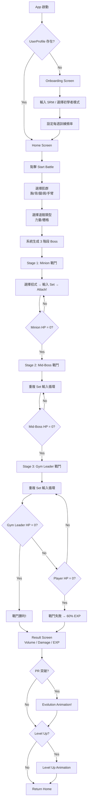
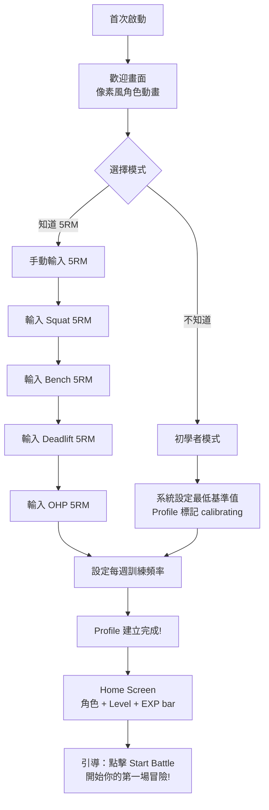
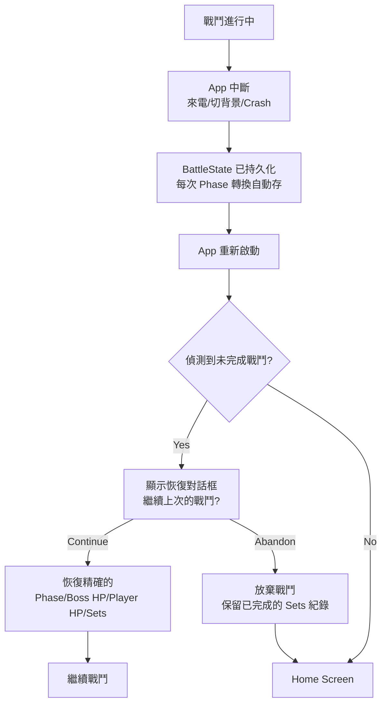

# UX Design Specification — IronMon

**Author:** Bruce
**Date:** 2026-02-28

---

## Executive Summary

### Project Vision

IronMon 是一款將真實健身訓練轉化為寶可夢風格 RPG 戰鬥的 Mobile App。核心理念：**「訓練即戰鬥，進步即升級」**。每一組臥推都是一次攻擊、每一次 PR 突破都是一次進化。不同於 Fitocracy 的徽章獎勵或 Habitica 的待辦事項 RPG，IronMon 的遊戲機制本身就是健身科學——漸進式超負荷 = 進化系統、強度閾值 = 破防門檻、訓練容量 = HP 削減。

**MVP 定位：** Experience MVP，驗證「健身 = 戰鬥」的核心體驗是否有趣。Solo developer（Bruce），iOS TestFlight 發布，完全離線運作。

### Target Users

**Primary — 中級訓練者（阿凱型）：**
- 健身 1-3 年，每週 3-5 天，有穩定訓練習慣
- 使用 Strong App 等紀錄工具，但覺得填表格無聊
- 對寶可夢有童年情懷
- 追求 PR 突破但近期遇到瓶頸，缺乏「再拼一下」的動力
- 了解 5RM、RPE、Volume 等健身術語

**Secondary — 新手（小美型）：**
- 辦了健身房會員但不知道該練什麼
- 不熟悉 5RM 概念，需要引導
- 被遊戲化元素吸引而嘗試

### Key Design Challenges

1. **健身房輸入效率：** 組間休息只有 60-120 秒，戴著手套，手上有汗。每組輸入必須 <5 秒完成，否則打斷訓練節奏
2. **數據輸入 vs 遊戲沉浸的平衡：** 需要輸入重量/次數/RPE，但不能讓使用者覺得在填表格
3. **數值可理解性：** 傷害公式涉及強度係數、屬性加成、RPE 倍率——使用者只需看到最終傷害數字和視覺反饋，不需理解背後數學
4. **新手無障礙：** 不知道 5RM 的使用者需要初學者模式平滑引導

### Design Opportunities

1. **進化動畫 = Aha Moment：** PR 突破觸發進化動畫是最強的情感獎勵，這個時刻的視覺和觸覺設計決定使用者是否會截圖分享
2. **力量 vs 體格道館的雙模式：** 用遊戲語言讓使用者直覺理解 Strength vs Hypertrophy training
3. **預填 + 快速調整：** 自動帶入上組數據 + ±2.5kg 按鈕，把「輸入」轉化為「微調」
4. **像素風視覺：** 8-bit RPG 風格天然適合 Low-fi 美術，降低美術資源需求同時營造懷舊感

---

## Core User Experience

### Defining Experience

**IronMon 的定義體驗：「輸入重量和次數，看到 Boss 被打飛」**

類似於：
- Tinder：「滑動配對」
- Pokémon：「丟精靈球捕捉」
- IronMon：**「輸入你的訓練組，看著傷害數字飛出、Boss HP 條下降」**

這是使用者會告訴朋友的核心互動。如果這個體驗做對了——輸入流暢、傷害反饋即時爽快、Boss 反應生動——其他一切都會跟著對。

### Platform Strategy

- **平台：** Flutter Mobile App（MVP 優先 iOS，TestFlight 發布）
- **觸控優先：** 所有核心互動為單手觸控操作
- **離線完整運作：** 健身房可能無 Wi-Fi，所有功能純本地
- **Device Features：** Haptic Feedback（攻擊/爆擊/進化）、螢幕常亮（戰鬥中）
- **使用情境：** 在健身房組間休息時使用，手可能戴手套、有汗

### Effortless Interactions

| 互動 | 設計目標 |
|------|---------|
| 每組訓練輸入 | <5 秒完成。預填上組數據，±2.5kg/±1 rep 大按鈕 |
| 開始戰鬥 | 2 步完成：選肌群 → 選道館類型 → 自動生成敵人 |
| 查看傷害 | 零步驟。輸入完自動計算、自動播放攻擊動畫 |
| 戰鬥狀態恢復 | 零步驟。App 重啟自動偵測未完成戰鬥，一鍵繼續 |
| RPE 輸入 | 1 步。滑桿或 3 個快速按鈕（輕鬆/中等/超硬） |

### Critical Success Moments

1. **First Hit：** 第一組訓練輸入後看到傷害數字飛出 + Boss HP 下降 → 「原來這就是戰鬥！」
2. **First Kill：** 第一次打倒 Boss → 勝利音效 + 經驗值動畫 → 「我贏了！」
3. **First Evolution：** 第一次 PR 突破 → 進化動畫 + 螢幕閃光 + 強化震動 → **核心 Aha Moment**
4. **Not Very Effective：** 力量道館中輕重量打不動 → 加重後破防 → 「原來要上大重量！」

### Experience Principles

1. **輸入即攻擊（Input = Attack）：** 每一次數據輸入都應該感覺像在發動攻擊，不是在填表格
2. **即時反饋（Instant Feedback）：** 傷害數字、HP 條變化、音效、震動在 200ms 內回應
3. **漸進揭示（Progressive Disclosure）：** 新手看到的是簡單的攻擊動畫，老手可以看到詳細的傷害公式分解
4. **失敗也是進步（Failure = Progress）：** 戰鬥失敗仍獲得 60% 經驗值，力竭是戰術撤退不是懲罰
5. **大按鈕設計（Glove-Friendly）：** 所有核心互動的 touch target ≥ 48×48dp

### User Mental Model

使用者帶入的心智模型是 **Pokémon 戰鬥**：
- 我選招式（選動作）
- 我攻擊敵人（輸入重量/次數）
- 敵人掉血（傷害數字）
- 打倒 Boss（勝利結算）
- 升級/進化（長期成長）

**與現有方案的差異：**
- Strong App = Excel 填表格 → IronMon = RPG 戰鬥
- Fitocracy = 完成任務拿徽章 → IronMon = 實際訓練數據驅動戰鬥
- Habitica = 打勾代辦事項 → IronMon = 重量/次數即傷害

### Novel UX Patterns

| 模式 | 類型 | 說明 |
|------|------|------|
| Set Input → Damage Output | **Novel** | 傳統健身 App 的輸入欄位轉化為攻擊行為 |
| 力量道館破防門檻 | **Novel** | 用「攻擊無效」讓使用者直覺理解強度閾值 |
| RPE → 爆擊倍率 | **Novel** | 自覺疲勞度轉化為遊戲機制 |
| 進化動畫 = PR 突破 | **Adapted** | 借用寶可夢進化概念，觸發條件改為 Epley 公式 |
| Boss 3 階段 | **Established** | 經典 RPG 小怪→中 Boss→最終 Boss 結構 |

### Experience Mechanics

**1. Initiation — 開始戰鬥：**
- Home Screen 點擊「Start Battle」
- 選擇肌群（5 個屬性按鈕：胸/背/腿/肩/手臂）
- 選擇道館類型（力量道館 or 體格道館）
- 系統自動生成 3 階段 Boss lineup + 戰鬥畫面載入

**2. Interaction — 戰鬥循環：**
- 底部顯示招式卡片（已解鎖的對應肌群招式）
- 點擊招式卡片 → 彈出 Set Input Panel
- Set Input Panel 預填上組數據（Weight / Reps / RPE）
- 使用者微調數字 → 點擊「Attack!」確認
- 攻擊動畫播放 → 傷害數字飛出 → Boss HP 條下降

**3. Feedback — 即時回饋：**
- 傷害數字顯示（白色普通/黃色爆擊/紅色 Super Effective）
- Boss HP 條 smooth animation
- Haptic feedback（輕震=普通攻擊、強震=爆擊、超強震=進化）
- 「It's not very effective...」文字提示（力量道館未破防）
- 「It's super effective!」文字提示（屬性剋制）

**4. Completion — 結算：**
- Boss HP 歸零 → 勝利 Jingle
- 結算畫面：總容量、傷害統計、經驗值 breakdown
- Level Up 提示（如果升級）
- Evolution 動畫（如果 PR 突破）
- 「Return Home」按鈕

---

## Desired Emotional Response

### Primary Emotional Goals

| 情感 | 觸發時機 | 設計手段 |
|------|---------|---------|
| **成就感（Accomplishment）** | 打倒 Boss、升級、解鎖招式 | 勝利動畫、經驗值累積條、解鎖通知 |
| **興奮感（Excitement）** | 爆擊、Super Effective、破防成功 | 螢幕閃光、強化震動、特效字體 |
| **驕傲感（Pride）** | PR 突破、進化動畫 | 全螢幕進化動畫、截圖分享誘導 |
| **掌控感（Empowerment）** | 選擇道館/招式、策略性調整重量 | 清晰的選擇 UI、即時傷害預估 |

### Emotional Journey Mapping

```
首次啟動 → 好奇（「這是什麼？」）
Onboarding → 期待（「趕快開始戰鬥！」）
第一組輸入 → 驚喜（「原來輸入重量就是攻擊！」）
打倒小怪 → 滿足（「這很有趣」）
中 Boss 血牛 → 專注（「要多做幾組才打得倒」）
力量道館不破防 → 挑戰（「要加重量才行」）
破防成功 → 興奮（「終於打動了！」）
打倒 Gym Leader → 成就感（「我贏了！」）
PR 突破進化 → 驕傲（「我真的變強了」）→ 截圖分享
戰鬥失敗 → 不甘心但不挫敗（「還是拿了 60% 經驗值，下次再來」）
```

### Micro-Emotions

- **Confidence > Confusion：** 每個畫面都有明確的下一步動作
- **Excitement > Anxiety：** Boss 數值讓人想挑戰而非恐懼
- **Accomplishment > Frustration：** 即使失敗也有收穫（60% EXP）
- **Delight > Satisfaction：** 進化動畫要超出期望，不只是「還行」

### Design Implications

| 情感目標 | UX 設計策略 |
|---------|-----------|
| 成就感 | EXP bar 動畫要 juicy、勝利 Jingle 要熱血、統計數字要大且清晰 |
| 興奮感 | 傷害數字要跳動、爆擊要有螢幕震動效果、顏色要鮮明 |
| 驕傲感 | 進化動畫要值得截圖、PR 數字要醒目突出 |
| 掌控感 | 傷害預估即時顯示、道館/招式選擇要清晰、重量調整要直覺 |
| 不挫敗 | 失敗文案要正向（「你仍然獲得了...」）、部分獎勵要視覺化呈現 |

### Emotional Design Principles

1. **每個回合都有獎勵感：** 即使單組傷害低，也要有數字飛出和 HP 條微動
2. **負面事件正面包裝：** 力竭 = 「Boss Counter Attack!」、失敗 = 「You earned 60% EXP」
3. **高峰低谷設計：** 小怪輕鬆（建立信心）→ 中 Boss 費力（製造張力）→ Gym Leader 爆發（情感高潮）
4. **分享誘導：** 進化動畫結束後自然呈現可截圖的成就畫面

---

## UX Pattern Analysis & Inspiration

### Inspiring Products Analysis

**1. Pokémon Games（寶可夢系列）**
- **UX 成功點：** 戰鬥 UI 極簡——4 個招式按鈕 + HP bar + 精靈動畫。資訊階層清晰
- **可借鑑：** 招式選擇的卡片式 UI、HP bar 動畫、屬性相剋的視覺提示（Super Effective 文字）
- **情感設計：** 進化動畫的儀式感、勝利 Jingle 的滿足感

**2. Strong App（健身紀錄）**
- **UX 成功點：** 快速輸入——預填上組、+/- 按鈕、大按鈕設計
- **可借鑑：** Set 輸入的 UX pattern（Weight/Reps 分離、預填邏輯）
- **問題：** 純紀錄無遊戲化，使用者覺得像填 Excel

**3. Duolingo（語言學習遊戲化）**
- **UX 成功點：** 連續天數 streak、每日目標、XP 系統、角色升級
- **可借鑑：** 經驗值動畫的 juiciness、升級時的慶祝動畫、簡潔的進度呈現
- **情感設計：** 失敗不懲罰（可重試）、小步前進的成就感

### Transferable UX Patterns

**Navigation Patterns：**
- Pokémon 式底部招式選擇（4 格 card layout）→ 適用於戰鬥中的招式選擇
- Strong App 式 set 輸入面板（底部 sheet slide up）→ 適用於重量/次數輸入

**Interaction Patterns：**
- Strong App 的 ±2.5kg stepper → 直接採用為核心輸入控制
- Pokémon 的 HP bar smooth drain animation → 用於 Boss HP 條
- Duolingo 的 XP splash animation → 用於經驗值獲得時的動畫

**Visual Patterns：**
- 8-bit pixel art aesthetic → 降低美術成本、營造懷舊感
- 寶可夢式屬性色彩系統（火=紅、水=藍等）→ 直接映射肌群屬性

### Anti-Patterns to Avoid

1. **❌ 過度動畫阻塞輸入：** 攻擊動畫不能阻止使用者進行下一組輸入（可 skip）
2. **❌ 強制教學：** 不要冗長的 onboarding tutorial，第一場戰鬥本身就是教學
3. **❌ 數值過載：** 戰鬥中不顯示公式細節，只顯示最終傷害數字
4. **❌ 懲罰性失敗：** 不扣道具、不扣等級，失敗只是少拿經驗值
5. **❌ 複雜導航：** 健身房使用情境下超過 2 層的導航就太多了

### Design Inspiration Strategy

**Adopt（直接採用）：**
- Strong App 的 set 輸入 UX（預填 + stepper）
- Pokémon 的 HP bar 動畫與屬性色彩
- Duolingo 的 XP splash 和升級慶祝

**Adapt（改造採用）：**
- Pokémon 戰鬥 UI 從 4 招式選擇簡化為「已選招式 + 輸入面板」
- RPG 回合制改為「一組訓練 = 一回合」的即時輸入模式

**Avoid（避免）：**
- Habitica 的複雜角色系統（MVP 只需等級 + 5RM）
- Fitocracy 的社交排行榜壓力（MVP 無社交）
- Ring Fit Adventure 的體感控制（IronMon 是數據輸入驅動）

---

## Design System Foundation

### Design System Choice

**選擇：Flutter Material 3 + Custom Pixel Theme Overlay**

IronMon 採用 Flutter 內建的 Material 3 Design System 作為基礎，搭配像素風客製化主題覆蓋層。

### Rationale for Selection

| 因素 | 決策 |
|------|------|
| 開發速度 | Solo developer，Material 3 內建 Widget 最豐富 |
| 自訂彈性 | Material 3 的 ColorScheme + ThemeData 可深度客製化 |
| 平台一致性 | Flutter Material 在 iOS 上表現穩定 |
| 品牌需求 | 像素風透過 Custom Widget（pixel_text.dart、type_badge.dart）實現 |
| Accessibility | Material 3 內建 WCAG AA 合規的 contrast ratio |

### Implementation Approach

1. **Base Layer：** Material 3 ThemeData 定義 ColorScheme、Typography、Component themes
2. **Pixel Overlay：** `presentation/shared/theme.dart` 覆寫 Material 預設風格
3. **Custom Widgets：** `pixel_text.dart`（像素字體）、`type_badge.dart`（屬性標籤）、`boss_hp_bar.dart`（AnimatedBuilder HP 條）
4. **Design Tokens：** 所有顏色、字型、間距定義為常數，集中管理

### Customization Strategy

- **保留 Material 3：** 按鈕、Input Field、Bottom Sheet、Dialog 等標準元件
- **覆寫 Material 3：** ColorScheme（像素風配色）、Typography（像素字體 + 系統字體混搭）
- **全客製：** Boss Sprite、Damage Display、Evolution Animation、Battle Screen Layout

---

## Visual Design Foundation

### Color System

**Primary Palette — 暗色戰鬥主題：**

| Token | Color | Hex | 用途 |
| --- | --- | --- | --- |
| `surface` | 深墨藍 | `#0D1117` | 主背景（戰鬥畫面、Home） |
| `surfaceVariant` | 深灰藍 | `#161B22` | 卡片背景、面板 |
| `primary` | 電光藍 | `#58A6FF` | 主要按鈕、活動狀態、連結 |
| `onPrimary` | 純白 | `#FFFFFF` | 按鈕文字 |
| `secondary` | 金黃 | `#F0C040` | 經驗值條、重要數字、等級 |
| `error` | 深紅 | `#F85149` | HP 條低血量、錯誤狀態、Counter Attack |
| `onSurface` | 淺灰白 | `#C9D1D9` | 一般文字 |
| `onSurfaceVariant` | 中灰 | `#8B949E` | 次要文字、Placeholder |

**Type Effectiveness Colors（屬性色彩）：**

| 屬性 | 肌群 | Color | Hex |
| --- | --- | --- | --- |
| FIRE | 胸 (Chest) | 橘紅 | `#FF6B35` |
| WATER | 背 (Back) | 深藍 | `#4B9CD3` |
| ROCK/GROUND | 腿 (Legs) | 土棕 | `#A0855B` |
| ELECTRIC | 肩 (Shoulders) | 亮黃 | `#FFD93D` |
| FIGHTING | 手臂/核心 (Arms) | 暗紅 | `#C2185B` |

**Semantic Colors：**

| Token | Hex | 用途 |
| --- | --- | --- |
| `damageNormal` | `#FFFFFF` | 普通傷害數字 |
| `damageCritical` | `#FFD93D` | 爆擊傷害 |
| `damageSuperEffective` | `#FF6B35` | Super Effective |
| `damageNotEffective` | `#8B949E` | 攻擊無效 |
| `hpHigh` | `#3FB950` | Boss HP > 50% |
| `hpMid` | `#F0C040` | Boss HP 25-50% |
| `hpLow` | `#F85149` | Boss HP < 25% |
| `expBar` | `#58A6FF` | 經驗值條 |

### Typography System

**Primary Font：** System default（SF Pro on iOS）— 用於所有功能性文字（輸入欄位、按鈕、說明文字）

**Accent Font：** Pixel-style bitmap font（Press Start 2P 或 Silkscreen）— 用於：
- 傷害數字
- Boss 名稱
- 「It's super effective!」等戰鬥訊息
- Level Up / Evolution 標題
- 屬性標籤

**Type Scale：**

| Level | Size | Weight | Font | 用途 |
| --- | --- | --- | --- | --- |
| Display | 48sp | Bold | Pixel | 傷害數字飛出 |
| H1 | 32sp | Bold | Pixel | 進化/升級標題 |
| H2 | 24sp | Bold | Pixel | Boss 名稱、畫面標題 |
| H3 | 20sp | SemiBold | System | Section 標題 |
| Body Large | 18sp | Regular | System | 主要內容 |
| Body | 16sp | Regular | System | 一般文字 |
| Body Small | 14sp | Regular | System | 次要文字、說明 |
| Label | 12sp | Medium | Pixel | 屬性標籤、數值標籤 |

### Spacing & Layout Foundation

**Base Unit：** 8dp grid system

| Token | Value | 用途 |
| --- | --- | --- |
| `spacing-xs` | 4dp | 內部元素間隔 |
| `spacing-sm` | 8dp | 緊密排列元素 |
| `spacing-md` | 16dp | 標準元素間距 |
| `spacing-lg` | 24dp | Section 間距 |
| `spacing-xl` | 32dp | 主要區塊間距 |
| `spacing-2xl` | 48dp | 畫面區域間距 |

**Touch Targets：**
- 最小 touch target：48 × 48dp（Material 3 標準）
- 核心戰鬥按鈕：56 × 56dp（戴手套操作）
- ±2.5kg stepper 按鈕：48 × 48dp
- 「Attack!」按鈕：full-width × 56dp

**Layout Principles：**
- 戰鬥畫面上半部：Boss 區域（Sprite + HP bar + Name），佔螢幕 40%
- 戰鬥畫面下半部：玩家操作區（招式卡片 + 輸入面板），佔螢幕 60%
- 底部安全區域：考慮 iOS Home Indicator
- 所有 padding：minimum 16dp

### Accessibility Considerations

- Color contrast ratio ≥ 4.5:1（所有文字對背景）
- 屬性資訊不僅用顏色區分，同時有文字標籤和圖示
- 傷害數字 size 足夠大（48sp），視覺障礙使用者也能看清
- Haptic feedback 輔助視覺反饋，不作為唯一回饋管道
- VoiceOver 支援所有核心操作（輸入重量、選擇招式、確認攻擊）

---

## Design Direction Decision

### Design Directions Explored

基於 IronMon 的核心定位「寶可夢風格健身 RPG」，探索以下視覺方向：

**Direction A — 復古 GameBoy（Pure Pixel）：**
全像素風，包含 UI 元素。彷彿在玩 GBA 時代的寶可夢。極度懷舊但可能影響輸入效率。

**Direction B — Modern Pixel Hybrid（推薦）：**
Boss 和戰鬥動畫用像素風，UI 控制元件用現代 Material 3。像素風的情感 + 現代 App 的效率。

**Direction C — Flat Modern with Pixel Accents：**
主體現代 flat design，僅傷害數字和 Boss sprite 用像素風點綴。最接近主流 App 但可能喪失 RPG 氛圍。

### Chosen Direction

**Direction B — Modern Pixel Hybrid**

核心原則：**「戰鬥是遊戲，輸入是工具」**

- Boss sprites、傷害數字、戰鬥訊息、進化動畫 → **像素風**（沉浸感）
- 重量/次數輸入、按鈕、導航、設定 → **現代 Material 3**（效率）
- 背景和氛圍 → **暗色系 + 微妙的像素紋理**

### Design Rationale

1. **效率優先：** 健身房中輸入效率比視覺風格更重要，Material 3 的 stepper、input field、bottom sheet 已經過大量 UX 驗證
2. **情感由像素負責：** 像素風 Boss、傷害數字、進化動畫承擔所有情感驅動的視覺元素
3. **開發效率：** Solo developer 用 Material 3 現成元件開發功能性 UI，自訂精力集中在像素風戰鬥元素
4. **品牌識別：** Hybrid 風格本身就是獨特的視覺識別——「像素 RPG 遇上現代健身 App」

### Implementation Approach

```
┌─────────────────────────────┐
│     Boss Area (Pixel)       │  ← 像素風 Boss sprite
│   [Boss HP Bar - Animated]  │  ← HP 條用 AnimatedBuilder
│   Boss Name (Pixel Font)    │  ← 像素字體
│   "Super Effective!" (Pixel)│  ← 戰鬥訊息
├─────────────────────────────┤
│   [Damage Numbers] (Pixel)  │  ← 傷害數字飛出動畫
├─────────────────────────────┤
│  ┌──────┐ ┌──────┐ ┌─────┐ │
│  │Move 1│ │Move 2│ │Move3│ │  ← Material 3 Card + 屬性色彩
│  └──────┘ └──────┘ └─────┘ │
├─────────────────────────────┤
│  [Set Input Panel]          │  ← Material 3 Bottom Sheet
│  Weight: [-2.5] 90kg [+2.5]│  ← Material 3 Stepper
│  Reps:   [-1]   8    [+1]  │
│  RPE:    [Easy][Med][Hard]  │
│  [====  ATTACK!  ====]      │  ← Full-width Material 3 Button
└─────────────────────────────┘
```

---

## User Journey Flows

### Journey 1: First Battle（阿凱的第一場戰鬥）



### Journey 2: Onboarding（小美的新手引導）



### Journey 3: Battle State Recovery（中斷恢復）



### Journey Patterns

**Navigation Pattern：** Linear with Escape
- 戰鬥流程是線性的（Minion → Mid-Boss → Gym Leader）
- 但隨時可以放棄戰鬥（保留部分紀錄）
- 結算後回到 Home，不會卡在子流程

**Input Pattern：** Pre-fill + Micro-adjust
- 系統永遠預填上一組的數據
- 使用者只需微調（±2.5kg、±1 rep）
- 確認按鈕要大且醒目

**Feedback Pattern：** Layered Response
- Layer 1：數字（傷害值、HP 變化）
- Layer 2：動畫（攻擊動畫、HP bar drain）
- Layer 3：觸覺（haptic feedback）
- Layer 4：音效（攻擊音、爆擊音）

### Flow Optimization Principles

1. **最短路徑到第一次攻擊：** 從 Home → 第一次 Attack 不超過 4 步（Start → 選肌群 → 選道館 → 第一組 Attack）
2. **零死角（No Dead Ends）：** 任何狀態都有退出路徑
3. **上下文保留：** 切換畫面不遺失輸入中的數據
4. **漸進複雜度：** Stage 1 Minion 只需基本輸入，Stage 3 Gym Leader 才需要策略性思考

---

## Component Strategy

### Design System Components

**直接使用 Material 3 的元件：**

| 元件 | 用途 | 客製化程度 |
| --- | --- | --- |
| `ElevatedButton` | 「Attack!」主按鈕、「Start Battle」 | 顏色主題覆寫 |
| `Card` | 招式卡片、結算資訊卡 | 加入屬性色彩邊框 |
| `BottomSheet` | Set Input Panel | 暗色主題 |
| `Slider` | RPE 輸入 | 客製 thumb 和 track 顏色 |
| `Dialog` | 戰鬥恢復確認、放棄確認 | 暗色主題 |
| `LinearProgressIndicator` | EXP bar | 客製顏色和動畫 |
| `NavigationBar` | 底部導航（Home / Pokédex） | 像素風圖示 |
| `ListTile` | 招式圖鑑列表項 | 加入屬性 badge |
| `TextField` | 5RM 輸入（Onboarding） | 暗色主題 |
| `SegmentedButton` | 肌群選擇、道館類型選擇 | 屬性色彩 |

### Custom Components

#### BossHpBar

**Purpose：** 顯示 Boss 當前 HP，smooth animation 從當前值過渡到新值
**Content：** Boss 名稱、屬性標籤、HP 數字、HP 條
**States：** High（綠）→ Mid（黃）→ Low（紅）→ Defeated（空）
**Implementation：** `AnimatedBuilder` + `Tween<double>` for smooth HP drain
**Architecture File：** `presentation/battle/widgets/boss_hp_bar.dart`

#### DamageDisplay

**Purpose：** 傷害數字飛出動畫，像素字體
**Content：** 傷害數字 + 效果文字（Super Effective / Not Effective / Critical）
**States：** Normal（白）、Critical（黃+閃光）、SuperEffective（橘+放大）、NotEffective（灰+縮小）
**Animation：** 數字從 Boss 位置向上飄出 + fade out，duration 800ms
**Implementation：** `AnimationController` + `SlideTransition` + `FadeTransition`
**Architecture File：** `presentation/battle/widgets/damage_display.dart`

#### SetInputPanel

**Purpose：** 快速輸入每組訓練數據（重量、次數、RPE）
**Content：** Weight stepper（±2.5kg）、Reps stepper（±1）、RPE selector（3 按鈕或 slider）、Attack 按鈕
**States：** Default（預填上組）、Editing（使用者調整中）、Submitting（送出動畫）
**Pre-fill Logic：** 自動帶入上一組的 Weight/Reps/RPE
**Touch Targets：** Stepper 按鈕 48×48dp、Attack 按鈕 full-width × 56dp
**Architecture File：** `presentation/battle/widgets/set_input_panel.dart`

#### MoveSelector

**Purpose：** 戰鬥中選擇要使用的招式
**Content：** 已解鎖且對應當前肌群的招式卡片（最多 4 張）
**Card Content：** 招式名稱、屬性圖示、PP 消耗、威力
**Layout：** 水平滾動卡片，每張 card 寬度 ~120dp
**Architecture File：** `presentation/battle/widgets/move_selector.dart`

#### TypeBadge

**Purpose：** 屬性標籤（顯示肌群屬性）
**Content：** 屬性名稱 + 屬性顏色 + 小圖示
**Variants：** Small（12sp，用於列表）、Medium（14sp，用於卡片）、Large（16sp，用於詳情頁）
**Architecture File：** `presentation/shared/type_badge.dart`

#### PixelText

**Purpose：** 像素字體文字 widget
**Content：** 文字 + 選擇性陰影/描邊
**Variants：** Display（48sp 傷害數字）、Heading（24-32sp 標題）、Label（12sp 標籤）
**Architecture File：** `presentation/shared/pixel_text.dart`

#### EvolutionAnimation

**Purpose：** PR 突破時的進化動畫
**Content：** 全螢幕覆蓋，螢幕閃光 + 像素粒子效果 + 新 5RM 數字顯示
**Duration：** 3-4 秒（可 tap 跳過）
**Haptic：** 強化震動序列
**Architecture File：** `presentation/battle/widgets/evolution_animation.dart`

#### FiveRmInputCard

**Purpose：** Onboarding 時輸入核心動作 5RM
**Content：** 動作名稱（中英）、動作圖示、數字輸入欄位、單位（kg）
**Validation：** 0-500kg 範圍、0.5kg 精度
**Architecture File：** `presentation/onboarding/widgets/five_rm_input_card.dart`

### Component Implementation Strategy

**Phase 1 — 核心戰鬥元件（Epic 2 需要）：**
- SetInputPanel（核心輸入）
- BossHpBar（HP 顯示）
- DamageDisplay（傷害回饋）
- MoveSelector（招式選擇）
- TypeBadge（屬性標籤）
- PixelText（像素字體）

**Phase 2 — 結算與成長元件（Epic 3-4 需要）：**
- EvolutionAnimation（進化動畫）
- Result Screen 統計 cards
- EXP bar 動畫

**Phase 3 — 圖鑑與增強元件（Epic 5 需要）：**
- MoveListTile（招式列表項）
- EvolutionChainView（進化鏈視覺化）

---

## UX Consistency Patterns

### Button Hierarchy

| Level | Style | Touch Target | 用途 |
| --- | --- | --- | --- |
| Primary | Filled, full-width | 56dp height | 「Attack!」「Start Battle」「Confirm」 |
| Secondary | Outlined | 48dp height | 「Return Home」「View Details」 |
| Tertiary | Text only | 48dp height | 「Skip」「Cancel」「Back」 |
| Stepper | Filled circle | 48×48dp | ±2.5kg、±1 rep |
| Destructive | Filled red | 48dp height | 「Abandon Battle」 |

### Feedback Patterns

**Success（成功）：**
- 視覺：綠色 checkmark + 短暫螢幕閃光
- 觸覺：中等震動 (impact medium)
- 用途：Boss 打倒、戰鬥勝利、升級

**Damage（傷害回饋）：**
- 視覺：傷害數字飛出 + HP bar 下降動畫
- 觸覺：輕震動 (impact light)
- 持續時間：數字飛出 800ms、HP bar drain 500ms

**Critical（爆擊/重要事件）：**
- 視覺：黃色閃光 + 放大數字 + 螢幕微震
- 觸覺：強震動 (impact heavy)
- 用途：Critical hit、Super Effective、PR 突破

**Error/Miss（失誤）：**
- 視覺：灰色文字「Miss!」或「It's not very effective...」
- 觸覺：雙短震（notification error）
- 文案永遠正向包裝，不用「失敗」字眼

**Warning（警告）：**
- 視覺：橘色文字 + 脈搏動畫
- 用途：Player HP 低於 25%、PP 即將耗盡

### Form Patterns

**Onboarding 5RM Input：**
- 數字鍵盤（非全鍵盤）
- 每個欄位獨立 card（一次一個動作）
- 即時驗證（超出合理範圍時提示）
- 可跳過 → 初學者模式

**Battle Set Input：**
- 預填模式：顯示上一組數據，使用者只需微調
- Stepper 控制：±2.5kg（重量）、±1（次數）
- RPE 三按鈕：輕鬆（6-7）/ 中等（8）/ 超硬（9-10）
- 單一確認按鈕：「Attack!」

### Navigation Patterns

**Primary Navigation：** Bottom Navigation Bar（2 tabs）
- Home（地圖/角色/開始戰鬥）
- Pokédex（招式圖鑑）

**Battle Navigation：** Linear sequential（不可跳轉）
- Gym Selection → Battle（3 Stages）→ Result → Home

**Route Structure：**

| Route | Screen | Navigation |
| --- | --- | --- |
| `/` | Home Screen | Bottom Nav Tab 1 |
| `/battle` | Battle Screen | Push from Home |
| `/battle/result` | Result Screen | Replace from Battle |
| `/pokedex` | Pokédex List | Bottom Nav Tab 2 |
| `/pokedex/:moveId` | Move Detail | Push from Pokédex |

### Loading & Empty States

**Loading：**
- 戰鬥載入：像素風 loading spinner + 「Generating opponents...」
- 資料載入：skeleton placeholder（Material 3 shimmer）

**Empty States：**
- 無訓練歷史：「Start your first battle!」+ 角色插圖
- 無解鎖招式（某屬性）：鎖頭圖示 + 「Reach level X to unlock」
- 招式圖鑑未解鎖：灰色剪影 + 解鎖條件文字

### Animation Patterns

| 動畫 | Duration | Easing | 觸發時機 |
| --- | --- | --- | --- |
| HP Bar Drain | 500ms | easeOutCubic | 每次造成傷害 |
| Damage Number Float | 800ms | easeOut + fade | 每次攻擊確認 |
| EXP Bar Fill | 1000ms | easeInOutCubic | 結算畫面 |
| Evolution Flash | 3000ms | custom | PR 突破 |
| Level Up Popup | 1500ms | bounceOut | 升級時 |
| Phase Transition | 600ms | easeInOut | Boss 切換 |
| Screen Shake | 200ms | elastic | 爆擊 / Counter |

---

## Responsive Design & Accessibility

### Responsive Strategy

**Mobile-Only（MVP）：** IronMon MVP 僅支援 iOS mobile。不需要 tablet 或 desktop 適配。

**iPhone Screen Size Adaptation：**

| Device | Screen Width | 策略 |
| --- | --- | --- |
| iPhone SE (3rd) | 375pt | 基準設計尺寸，確保所有元素可用 |
| iPhone 14/15 | 390pt | 標準體驗 |
| iPhone 14/15 Pro Max | 430pt | 額外間距，Boss 區域稍大 |

**Layout Adaptation Rules：**
- Boss sprite area：固定高度比例（螢幕高度 × 0.35）
- Set Input Panel：固定底部，高度自適應內容
- Move Selector cards：水平滾動，card 寬度固定 120dp
- 底部安全區域：respect `MediaQuery.of(context).padding.bottom`

### Breakpoint Strategy

MVP 不需要 breakpoint（mobile-only）。未來 tablet 支援時：
- 375-430pt：現有 mobile layout（單欄）
- 768pt+：雙欄 layout（左側戰鬥、右側輸入面板）

### Accessibility Strategy

**Target Level：** WCAG 2.1 AA

**Color & Contrast：**
- 所有文字 contrast ratio ≥ 4.5:1（normal text）、≥ 3:1（large text）
- 屬性系統不僅靠顏色區分：每個屬性有獨特圖示 + 文字標籤
- HP 條顏色變化同時有數字百分比顯示
- 傷害數字有背景陰影確保在任何 Boss sprite 上可見

**Touch Accessibility：**
- 所有互動元素最小 touch target：48 × 48dp
- 核心戰鬥按鈕（Attack!、±Stepper）：48-56dp
- 按鈕間距 ≥ 8dp 防止誤觸

**VoiceOver Support：**
- 所有按鈕有 semanticLabel
- Boss HP：「Boss [name], HP [current] out of [max], [percentage] percent」
- 傷害數字：「Dealt [number] damage, [effectiveness message]」
- Set Input：「Weight [value] kilograms, Reps [value], RPE [level]」

**Motion & Animation：**
- 尊重 `MediaQuery.of(context).disableAnimations`
- 所有動畫可被系統 Reduce Motion 設定關閉
- 進化動畫的螢幕閃光強度可調

### Testing Strategy

**Accessibility Testing：**
- VoiceOver 手動測試所有核心流程
- Xcode Accessibility Inspector 驗證 contrast ratio
- 實機測試 Dynamic Type（字體放大 1.5x 不破版）

**Device Testing：**
- iPhone SE 3（最小螢幕）
- iPhone 15（標準）
- iPhone 15 Pro Max（最大螢幕）

### Implementation Guidelines

**Flutter Accessibility：**
- 使用 `Semantics` widget 為所有自訂元件添加 accessibility 資訊
- 戰鬥畫面的 `RepaintBoundary` 不影響 accessibility tree
- `ExcludeSemantics` 用於純裝飾性元素（Boss sprite 背景粒子）
- `MergeSemantics` 合併 stepper 按鈕群組

**Performance-Related Accessibility：**
- 60fps 動畫確保不會造成視覺不適
- 傷害數字飛出動畫持續 800ms（不會太快閃爍）
- 螢幕閃光效果尊重 accessibility 設定
